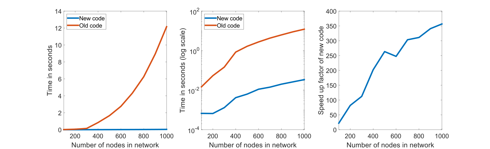

# FasterMatchingIndex

This is code for computing the matching index much faster. This is of particular relevance for people using generative network models.

## What is the matching index?

The matching index, as typically used, is a measure that quantifies the similarity in two nodes connectivity profiles and this understood to be a normalised meaure of the overlap in two nodes neighbourhoods* (also not that everything discussed will apply to undirected, unweighted networks). The index is calculated on an adjacency matrix $A$, and is mathematically defined as:

$$M_{ij} = \frac{|\Gamma_{i}-{j}\cap \Gamma_{j}-{i}|}{|\Gamma_{i}-{j}\cup \Gamma_{j}-{i}|}\tag {1}$$

where $\Gamma_{i}-{j}$ is the set of neighbours $N$ of node $i$ excluding node $j$ (if it is at all connected to node $j$). 

<sub>* See the [section below](#what-did-you-mean-when-you-said-the-matching-index-may-not-measure-what-I-think-it-does) discussing how the matching index may not measure precisely what we usually think it does...</sub>

## So what is the problem?

The matching index has often been found to give the best performance among topological generative network models (for example, see [here](https://doi.org/10.1016/j.neuroimage.2015.09.041) [here](https://www.science.org/doi/10.1126/sciadv.abm6127) [here](https://doi.org/10.1016/j.neuroimage.2020.117510) [here](https://doi.org/10.1038/s41467-021-24430-z) and [here](https://doi.org/10.1002/dev.22405)), meaning that it is the model people are most interested in running.

_HOWEVER_

It takes agesssssssssssssssssssssss to run (in my experience I could run every single other topological model in the time it takes to run the matching model)

This likely makes you sad :cry:

But what if I told you there was a way to make it (somewhat) better...

## I'm interested now, why can it be made faster?

To understand why it can be made faster, we need to talk more maths (sorry).

We can also calculate the matching index as

$$M_{ij} = \frac{2(N_{ij}-A_{ij})}{k_{i}+k_{j}-2A_{ij}}\tag {2}$$

which is just the number of neighbours $i$ and $j$ share multiplied by two (whilst excluding themselves as neighbours of the other, that’s what the $-A_{ij}$ is for), then divided by the summed degree $k$ of nodes $i$ and $j$ (whilst ignoring any connection that may exist between nodes $i$ and $j$).

When written this way it is trivial* to see how the calculation could easily be done programmatically. If you look at the original code provided in the [BCT](https://sites.google.com/site/bctnet/), you'll notice it is actually calculating it the second way and not the first. However it is looping over all the nodes to calculate it. We can actually forgo any loops when calculating this measure resulting in a considerable speed up in processing speed.

<sub>* I've always wanted to say this haha. The reason it is trivial is because we can take advantage of matrix operations to compute this value (as the number of neighbours can be easily computed by taking the square of the matrix, and degree can very easy be obtained by just taking the sum. Stack this vector $n$ times, where $n$ is the number of nodes in the network, then simply add the transpose of this matrix to it et voila, you have a matrix where each element is the sum of those two nodes respective degree)</sub>

## So how much faster is it?

First, lets compare calculating the matching index on networks with different numbers of nodes:



You can see that the old way takes significantly longer when computing the index than the new way, and this time only increases as the network gets larger! So the benefits of using the new code gets considerably better as the network gets larger

## Yes that's neat Stuart, but what about its use in generative network models?

An important thing to note about generative network models is they _iteratively_ add edges. As I alluded to before, the new code largely benefits because it can calculate everything in one hit instead of needing to loop over all the nodes. In the old generative model node, at each iteration the loop to calculate the matching index only runs over nodes who will be affected by the newly added edge i.e., the loop very likely doesn't need to be run over all nodes. So because of this we won't see the some order of magnitude levels of improvement. But what improvement do we see? First lets just calculate the matching index using networks of a similar size and density I used in my [paper](https://www.science.org/doi/10.1126/sciadv.abm6127). I generated 100 different models with the old and new code and compared the time it takes to compute them:


A fourfold speed-up is pretty good!

## Ok, how does this change as a factor of the size of the network and the number of edges being requested?

Below I generated networks of different node sizes and edge counts:

 

You'll notice as the number of nodes increases, the new code gives bigger and bigger benefits. You will also notice, as the number of edges increases, the improvement of the new codes lessens (but it is much still better). To try to better understand why the impact of the new code lessens as more edges are added we can exploit the fact the if you run a generative model for X edges, you will also have generated a network of 1 to X-1 edges as well, as each iteration is technically creating a new network (it is just building upon the previous iteration). If we record the time it takes to do each iteration we can see how the improvement varies: 

 

Here we can clearly see that as more edges need to be made, the code slows down, but depending on the number of nodes it doesn't slow down at the same rate. I thought this might be occuring as a factor of network density, so I went to two extremes. First I generated all 4950 edges for a network of size 100


Then I generated all 124750 edges for a network of size 500:

So there is some threshold


I am not completely sure as to why the improvement lessens over time (might be something with having to index more and nodes on later iterations?). If anyone has any ideas would be interested to know! But putting this curious coding quirk case study aside, the new version is faster, particularly for the network scale generative network models tend to be used at.

## I want to see this with my own eyes

Easy! Just run the script I wrote to demonstrate this in MATLAB

```
matchingSpeedTest.m
```

Note it does use the Parallel Computing Toolbox, just to speed things up a bit. It still takes well over 4 hours to run everything when using the Toolbox on an i7 6700k FYI 

## What did you mean when you said the matching index may not measure precisely what I think it does?

The matching index is commonly considered a normalised measure of the overlap of two nodes' neighbourhoods. Conceptually, we would understand this as meaning the number of shared neighbours divided by the total unique neighbours, as the original mathematical definition shown in Equation 1 suggests.

Consider the network below:

![An example network to illustrate how the matching index is calculated. The matching index is being calculated between the two blue nodes (labelled i and j). They share three neighbours (red nodes). Their combined neighbourhood size is 10 (red nodes plus grey nodes). They also share six connections to neighbouring nodes (red edges), and have 13 total connections (red edges plus black edges). Note that by convention, direct connections between the nodes of interest (in this case the blue nodes) are discounted](./images/MatchingDemoNetwork.svg)

Node $i$ and $j$ share three neighbours (red nodes). The combined total of (unique) neighbours $i$ and $j$ have is 10 (red and grey nodes), so we would assume the matching index of these nodes is $\frac{3}{10}$.

We would _technically_ be incorrect however, or rather we would have a different answer to what the code (both old and new) provides.

As mentioned above, the matching index is similarity in the _connectivity profiles_ of two nodes. This means the matching index is actually calculated as the number of connections a pair of nodes have to same neighbours, over the total number of connections those nodes have. So in the example above, as node $i$ and $j$ share three neighbours they have six connections in common (red edges). They have 13 connections in total (red edges plus the black edges, note the connection between them is excluded by convention), so the matching index is $\frac{6}{13}$. 

I would say that this definition isn't exactly consistent with what we would expect from Equation 1 (in my opinion), but it is exactly how Equation 2 is done (and how it is done in both the new and old code by default). I would argue that this definition/conceptualisation (which I shall call the connectivity profiles definition) isn't the most intuitive. We can change Equation 2 to be more consistent with the intuitive conceptualisation (which I shall call the normalised overlapping neighbourhood definition) by doing the following

$$M_{ij} = \frac{N_{ij}-A_{ij}}{k_{i}+k_{j}-2A_{ij}-N_{ij}}\tag {3}$$

## Do these differing conceptualisations affect anything?

Not really. They will give different results as I showed above, but so long as the same calculation is being used throughout the analysis, it should be ok. May affect how you discuss and interpret this measure though. The code I provided does the connectivity profiles definition by default, but does allow for the normalised overlapping neighbourhood definition to be done as well (note this is only done for the "matching.m" function, all the generative modelling functions at current can only use the connectivity profiles formulation).

## I would like to incorporate these new ways of computing the matching index into my own code, is there an easy way to do this?

Good news! I have written code which allows you to do this! The inputs and outputs should be very similar to what the BCT/Betzel implementation used (and is consistent with the code I wrote for my [paper](https://www.science.org/doi/10.1126/sciadv.abm6127)) 

I have it for the multiplicative and additive formulation of the generative network model. 

## Wow this is so great, you're amazing Stuart

Thank you, I appreciate it.

## Who or what should I cite for this implementation?

This code is built off of [Betzel 2016](https://doi.org/10.1016/j.neuroimage.2015.09.041) and my own [paper](https://www.science.org/doi/10.1126/sciadv.abm6127), you can also references this GitHub.

## Who should I contact if I have questions/complaints? 

You can email me at stuart.oldham@mcri.edu.au

## Is there a Python version?

Ha no. I leave it as an exercise to the reader to figure that one out.
